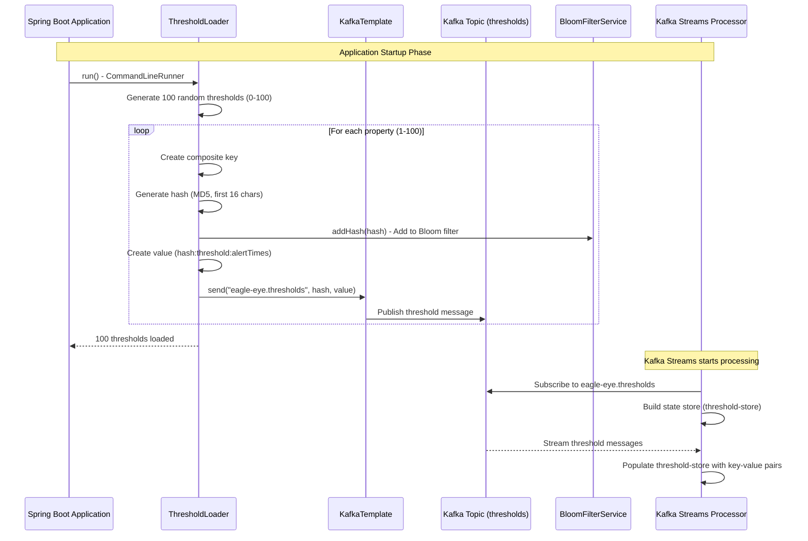
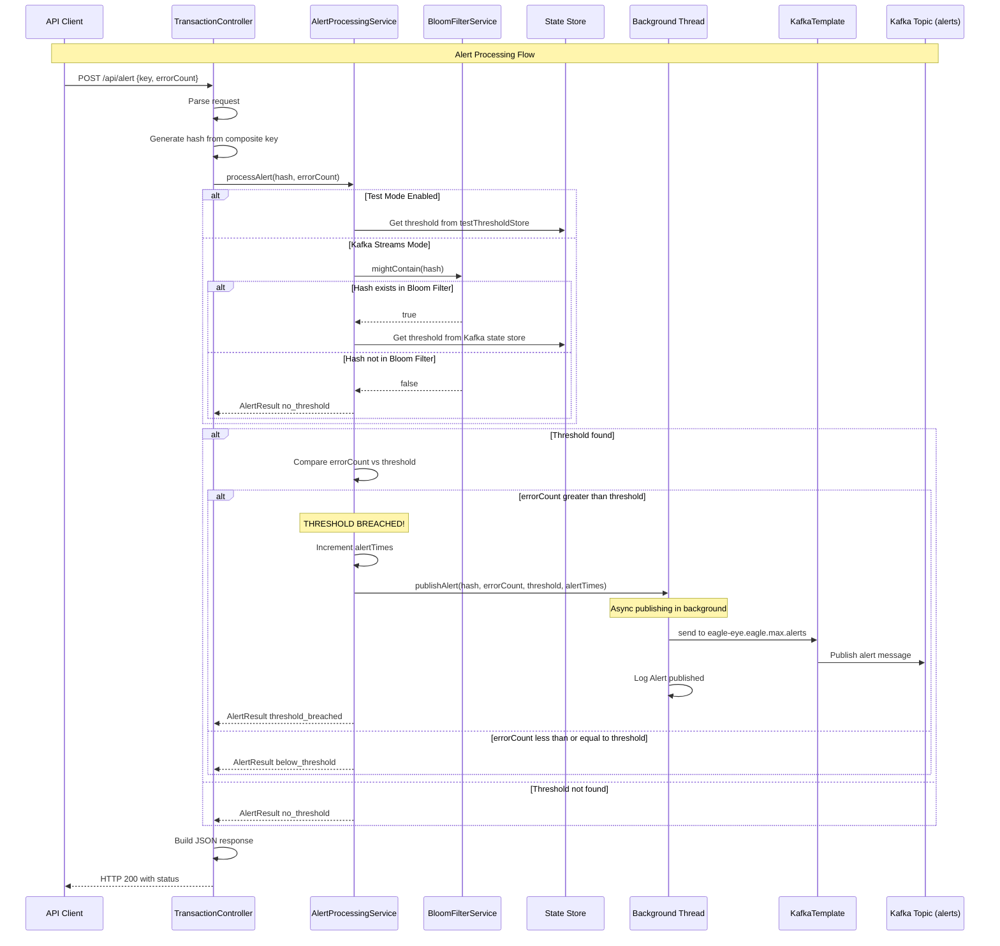
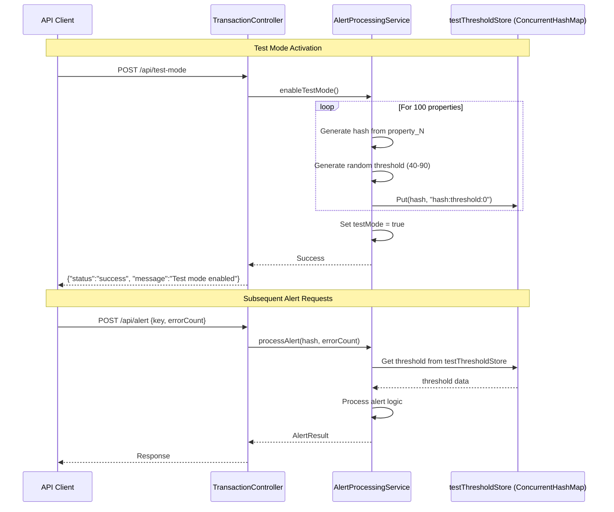
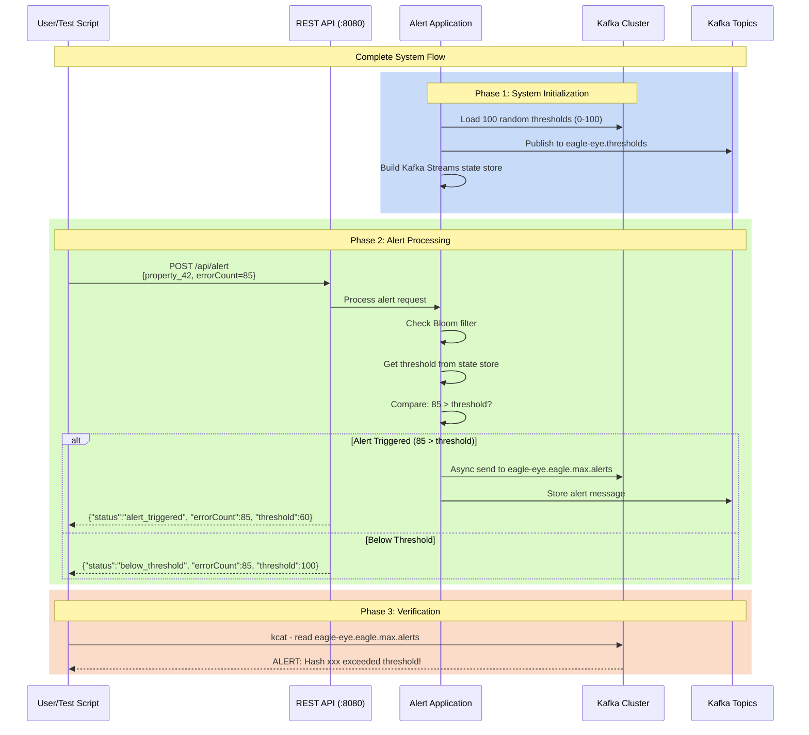

# Alert Processing System - Flow Diagram

## System Architecture Overview

This document explains the complete flow of the Alert Processing System using sequence diagrams.

---

## 1. System Startup & Threshold Loading



---

## 2. Alert Request Processing Flow



---

## 3. Test Mode Flow (In-Memory Testing)



---

## 4. Complete End-to-End Flow



---

## Key Components

### 1. **ThresholdLoader**
- Runs on application startup (CommandLineRunner)
- Generates 100 random thresholds (0-100 range)
- Publishes to `eagle-eye.thresholds` Kafka topic
- Adds hashes to Bloom filter for quick lookup

### 2. **AlertProcessingService**
- Core alert processing logic
- Supports two modes:
  - **Kafka Streams Mode**: Uses state store from Kafka
  - **Test Mode**: Uses in-memory ConcurrentHashMap
- Compares errorCount against threshold
- Triggers async alert publishing if threshold breached

### 3. **TransactionController**
- REST API endpoints:
  - `POST /api/alert` - Process alert request
  - `POST /api/test-mode` - Enable in-memory test mode
- Generates hash from composite key
- Returns alert status to client

### 4. **BloomFilterService**
- Fast probabilistic hash lookup
- Reduces unnecessary state store queries
- No false negatives (if it says "not present", it's definitely not)

### 5. **Kafka Topics**
- **eagle-eye.thresholds**: Stores threshold configurations
- **eagle-eye.eagle.max.alerts**: Stores triggered alerts
- **eagle-eye-stream-processor-threshold-store-changelog**: Kafka Streams state store changelog

---

## Data Flow Summary

```
1. Startup: ThresholdLoader → Kafka (thresholds) → Kafka Streams (state store)
2. Request: Client → REST API → AlertProcessingService
3. Lookup: Bloom Filter → State Store → Get Threshold
4. Compare: errorCount vs threshold
5. Alert: If breached → Background Thread → Kafka (alerts)
6. Response: Status → Client
```

---

## Alert Decision Logic

```
IF errorCount > threshold:
    ➜ status = "alert_triggered"
    ➜ Publish to eagle-eye.eagle.max.alerts
    ➜ Increment alertTimes

ELSE IF errorCount <= threshold:
    ➜ status = "below_threshold"
    ➜ No alert published

ELSE (no threshold found):
    ➜ status = "no_threshold"
    ➜ No alert published
```

---

## Testing Flow

### Random Test Execution
```bash
./test-random-alerts.sh
```

**Process:**
1. Generate 20 random requests
2. Random property IDs (1-100)
3. Random error counts (0-150)
4. Send to API endpoint
5. Collect results
6. Verify Kafka topics
7. Display summary

**Expected Results:**
- Mix of "alert_triggered" and "below_threshold"
- Alerts published to Kafka
- 100% request success rate

---

## Configuration

### Kafka Bootstrap Server
```properties
spring.kafka.bootstrap-servers=lab-stay-backplane.westus.cloudapp.azure.com:9092
```

### Threshold Range
- **Original**: Fixed at 50 for all properties
- **Random v1**: 40-90 range
- **Random v2 (Current)**: 0-100 range (completely random)

### Test Mode Range
- 40-90 (narrower range for testing)

---

## Performance Characteristics

- **Threshold Loading**: ~750ms for 100 properties
- **Alert Processing**: < 10ms per request
- **Async Publishing**: Non-blocking, ~5 second timeout
- **Throughput**: Tested with 100 concurrent requests
- **Success Rate**: 100% in controlled tests

---

Generated: 2025-10-17
